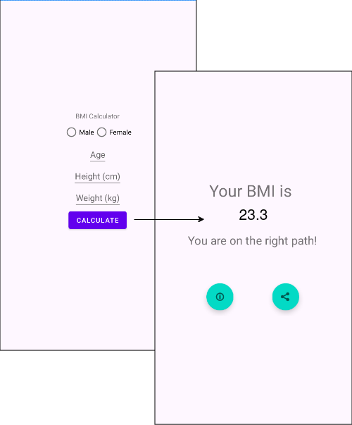

# 02 - Intents 

 An [Intent](https://developer.android.com/reference/android/content/Intent) is a messaging object you can use to request an action from another [app component](https://developer.android.com/guide/components/fundamentals#Components). Although intents facilitate communication between components in several ways, there are three fundamental use cases:
- Starting an activity
- Starting a service
- Delivering a broadcast

----

The primary pieces of information in an intent are:

- **action** -- The general action to be performed, such as `ACTION_VIEW`, `ACTION_EDIT`, `ACTION_MAIN`, etc.

- **data** -- The data to operate on, such as a person record in the contacts database, expressed as a Uri.

Some examples of action/data pairs are:

`ACTION_VIEW content://contacts/people/1` -- Display information about the person whose identifier is "1".

`ACTION_DIAL content://contacts/people/1` -- Display the phone dialer with the person filled in.

Here is a complete list of the attributes containted in the `Intent` class:

| Attribute | Description                                                                                                    | Example                                                               |
|-----------|----------------------------------------------------------------------------------------------------------------|-----------------------------------------------------------------------|
| **Action**    | Specifies the general action to be performed, such as `ACTION_VIEW` or `ACTION_SEND`.                              | `Intent.ACTION_VIEW`, `Intent.ACTION_SEND `                               |
| **Data**     | The URI of the data that the intent is operating on, typically used with `ACTION_VIEW` or `ACTION_EDIT`.           | `intent.data = Uri.parse("https://example.com")  `                      |
| **Category**  | Provides additional information about the action to be performed, like `CATEGORY_DEFAULT` or `CATEGORY_BROWSABLE`. | `intent.addCategory(Intent.CATEGORY_DEFAULT)`                           |
| **Component** | Specifies the explicit target component (*Activity*, *Service*, or *BroadcastReceiver*) to handle the intent.        | `intent.component = ComponentName(context, TargetActivity::class.java)` |
| **Extras**    | Key-value pairs for additional data, used to pass information between components.                              | `intent.putExtra("KEY_NAME", "value")`                                  |
| **Flags**     | Instructions on how the intent should be handled, controlling activity launch modes, task management, etc.     | `intent.flags = Intent.FLAG_ACTIVITY_NEW_TASK `                         |
| **Type**      | Specifies the MIME type of the data in the intent.                                                             | `intent.type = "image/*" `                                              |
| **Package**   | Specifies the package name to restrict the intent to a specific app.                                           | `intent.setPackage("com.example.app")`                                  |
| **ClipData**  | Data related to a primary or secondary intent, typically for copy-paste or drag-and-drop functionality.        | `intent.clipData = ClipData.newUri(contentResolver, "Label", uri)`      |


### Starting an activity

 You can start a new instance of an Activity by passing an Intent to [`startActivity()`](https://developer.android.com/reference/android/content/Context#startActivity(android.content.Intent)). The Intent describes the activity to start and carries any necessary data.


**Start Activity from current Activity**
 ```kotlin
val intent = Intent(this, TargetActivity::class.java)
intent.putExtra("KEY_NAME", "Your Data Here") 
//this data will be transmitted to the Target Activity
startActivity(intent)
```

**Get data on Target Activity**
```kotlin
val data = intent.getStringExtra("KEY_NAME")
```


### Starting a service

You can start a service to perform a one-time operation (such as downloading a file) by passing an Intent to [`startService()`](https://developer.android.com/reference/android/content/Context#startService(android.content.Intent)). The Intent describes the service to start and carries any necessary data.


**Starting a service from current activty**
```kotlin
val myIntent = Intent(this, MyService::class.java)
myIntent.putExtra("EXTRA1", "https://example.com/path/to/file")
myIntent.putExtra("EXTRA2", "downloaded_file_name.ext")
startService(myIntent)
```

```kotlin
import android.app.IntentService
import android.content.Intent

class MyService : IntentService("MyService") {

    override fun onHandleIntent(intent: Intent?) {
        val fileUrl = intent?.getStringExtra("EXTRA1") ?: return
        val fileName = intent.getStringExtra("EXTRA2") ?: "downloaded_file"

        try { 
            //Do something with received data
            Log.d("MyService", "Done!")

        } catch (e: Exception) {
            Log.e("MyService", "Error", e)
        }
    }
}
```


:::info

With Android 5.0 (API level 21) and later, you can start a service with [`JobScheduler`](https://developer.android.com/reference/android/app/job/JobScheduler).

:::

### Delivering a broadcast

The system delivers various broadcasts for system events, such as when the system boots up or the device starts charging. You can deliver a broadcast to other apps by passing an Intent to [`sendBroadcast()`](https://developer.android.com/reference/android/content/Context#sendBroadcast(android.content.Intent)) or [`sendOrderedBroadcast()`](https://developer.android.com/reference/android/content/Context#sendOrderedBroadcast(android.content.Intent,java.lang.String)).


```kotlin
// Define a custom action for your broadcast
const val CUSTOM_ACTION = "com.example.MY_CUSTOM_BROADCAST"

// Function to send the broadcast
fun sendCustomBroadcast(context: Context) {
    val intent = Intent(CUSTOM_ACTION)
    intent.putExtra("EXTRA_DATA", "This is some extra data!")
    context.sendBroadcast(intent)
}
```

```kotlin
import android.content.BroadcastReceiver
import android.content.Context
import android.content.Intent
import android.util.Log

class MyBroadcastReceiver : BroadcastReceiver() {
    override fun onReceive(context: Context, intent: Intent) {
        if (intent.action == CUSTOM_ACTION) {
            val extraData = intent.getStringExtra("EXTRA_DATA")
            Log.d("MyBroadcastReceiver", "Received broadcast with data: $extraData")
        }
    }
}
```

## [Intent Resolution](https://developer.android.com/reference/android/content/Intent#intent-resolution)

There are two primary forms of intents you will use **Implicit intents** and **Explicit intents**.


|     Feature     |                 Implicit Intent                |             Explicit Intent             |
|:---------------:|:----------------------------------------------:|:---------------------------------------:|
| Definition      | Specifies a general action, no specific target | Targets a specific component or app     |
| Purpose         | Allows user/system to choose handler           | Directly calls a specific component     |
| Use Cases       | Share text, open URL                           | Start internal activity, launch service |
| System Behavior | Shows chooser if multiple apps can handle      | Launches directly without user choice   |


### Intent filters

When you use an implicit intent, the Android system finds the appropriate component to start by comparing the contents of the intent to the **intent filters** declared in the [manifest file](https://developer.android.com/guide/topics/manifest/manifest-intro) of other apps on the device. If the intent matches an intent filter, the system starts that component and delivers it the `Intent` object.


Intent filters based on three aspects:

- [Action](https://developer.android.com/guide/topics/manifest/action-element) - at least one needs to be specified
- [Data](https://developer.android.com/guide/topics/manifest/data-element) (both URI and data type) - 0 or more can be specified
- [Category](https://developer.android.com/guide/topics/manifest/category-element) - 0 or more can be specified


```xml
<activity android:name="ShareActivity" android:exported="false">
    <intent-filter>
        <action android:name="android.intent.action.SEND"/>
        <category android:name="android.intent.category.DEFAULT"/>
        <data android:mimeType="text/plain"/>
    </intent-filter>
</activity>
```


## Exercices

Using the initial project structure from [lab01](../01/index.md), add buttons for each of the follwing actions:

   In **MainActivity** 
   1.  Start a new activity which displays the calculated bmi along with some useful tips.  
   
    

In  **SecondActivity**
   
   1. Share results as text to other apps.  
   2. Redirect the user to webpage about bmi. 
   :::info

   You need to specify in the manifest file `<queries>`

   :::
   3. Starts a service that will download the following cheeat sheet. 

https://odphp.health.gov/sites/default/files/2021-05/DGA-FactSheet-2021-03-26-compressed.pdf

:::note

- What type of Intent is used for each of the 4 buttons? (Implicit/Explicit)
- What type of Action should you use for buttons 1 and 2 from the Second Activity?

:::


