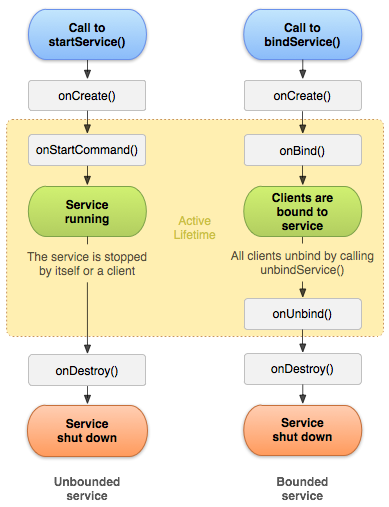
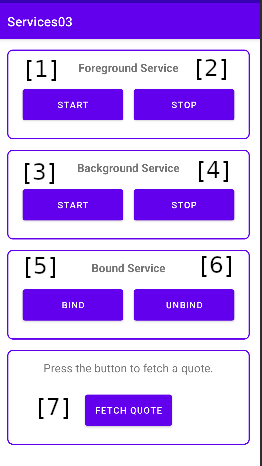

# 03 - Services

A Service is an application component that can perform long-running operations in the background. It does not provide a user interface. Once started, a service might continue running for some time, even after the user switches to another application.

:::warning

In Android, services (e.g., Service) by default run on the main thread, so any long-running or blocking task directly executed in onStartCommand() will freeze the UI and potentially cause an Application Not Responding (ANR) error.

:::

A service is simply a component that can run in the background, even when the user is not interacting with your application, so you should create a service only if that is what you need. For example, a thread in an activity would be more useful displaying data periodically or continuously in the UI.


## The service lifcycle

All services should extend the Service class. Depending on whether the service want to comunicate with other components the service can be bounded (data can be requested from the service) or unbounded. 




| Callback Method  | Purpose                                                                                              |
|------------------|------------------------------------------------------------------------------------------------------|
| onCreate()       | Initialize resources required by the service. This is called only once during the service lifecycle. |
| onStartCommand() | Handle the service start request. Perform tasks that need to run in the foreground or background.    |
| onBind()         | Return an IBinder to allow the client to communicate with the service.                               |
| onUnbind()       | Perform cleanup for the service when no clients remain bound.                                        |
| onRebind()       | Handle cases where clients return to a previously unbound service.                                   |
| onDestroy()      | Clean up any remaining resources, stop threads, and save final states.                               |

## Services types


### Background services

A background service performs an operation that isn't directly noticed by the user. For example, if an app used a service to compact its storage, that would usually be a background service. 

#### Starting a background service
- Caller component side
```kotlin
val intent = Intent(this, BackgroundService::class.java)
startService(intent)
```
- Service side
  
```kotlin
override fun onStartCommand(intent: Intent?, flags: Int, startId: Int): Int {
    //start task...
    return START_STICKY
}
```

:::info

`onStartCommand()` has to return one of the following constants


- `START_NOT_STICKY`
    If the system kills the service after onStartCommand() returns, do not recreate the service unless there are pending intents to deliver. 
- `START_STICKY`
    If the system kills the service after onStartCommand() returns, recreate the service and call onStartCommand(), but do not redeliver the last intent. 
- `START_REDELIVER_INTENT`
    If the system kills the service after onStartCommand() returns, recreate the service and call onStartCommand() with the last intent that was delivered to the service. 

:::

#### Stoping a background service

- Caller component side
```kotlin
val intent = Intent(this, BackgroundService::class.java)
stopService(intent)

```
**OR**

- Service side
  
```kotlin
stopSelf()
```
**+**
- Service side

```kotlin
override fun onDestroy() {
    super.onDestroy()
    //cleanup ...
    Log.d(TAG, "Service stopped")
}
```

#### Running a task inside the service 
```kotlin
//task
private fun startTask() {
    Thread {
        // do something...
        Log.d("Task", "log progress")
    }.start()
}
```
### Foreground services
A foreground service performs some operation that is noticeable to the user. For example, an audio app would use a foreground service to play an audio track. Foreground services must display a Notification. Foreground services continue running even when the user isn't interacting with the app.

#### Starting a foreground service

- Caller component side

```kotlin
val intent = Intent(this, ForegroundService::class.java)
startService(intent)
```

- Service side
  
```kotlin
override fun onStartCommand(intent: Intent?, flags: Int, startId: Int): Int {

   // define a channel for the notification
   // this is used so that you can group the types of notifications you want to have in your app
    val channelId = "ForegroundServiceChannel"
    val channelName = "Foreground Service"

    val notificationManager = getSystemService(NOTIFICATION_SERVICE) as NotificationManager
    val channel = NotificationChannel(
        channelId,
        channelName,
        NotificationManager.IMPORTANCE_HIGH
    )
    notificationManager.createNotificationChannel(channel)

    //create a notification
    val notification = Notification.Builder(this, channelId)
        .setContentTitle("Notification title")
        .setContentText("Content: $data")
        .setSmallIcon(android.R.drawable.ic_notification_overlay)
        .build()

    //this is when the foreground service actually starts
    startForeground(1, notification)

    //start task ...
    return START_STICKY
}
```


#### Stoping a foreground service

- Caller component side
```kotlin
val intent = Intent(this, ForegroundService::class.java)
stopService(intent)
```

- Service side
```kotlin
override fun onDestroy() {
    super.onDestroy()
    //cleanup...
    Log.d(TAG, "Service stopped")
}
```

#### Updating data in the notification

```kotlin
//task
private fun startTask() {
    Thread {
        while (taskRunning) {
            //do something...
            updateNotification()
        }
    }.start()
}

private fun updateNotification() {
    val notification = Notification.Builder(this, "ForegroundServiceChannel")
        .setContentTitle("Notification title")
        .setContentText("Content: $data")
        .setSmallIcon(android.R.drawable.ic_notification_overlay)
        .build()

    //use notification manager to pass the updated notification
    val notificationManager = getSystemService(NOTIFICATION_SERVICE) as NotificationManager
    notificationManager.notify(1, notification)
}
```

:::info

Aditional permissions need to be set in the AndroidManifest file
```xml
<uses-permission android:name="android.permission.FOREGROUND_SERVICE" />
<uses-permission android:name="android.permission.POST_NOTIFICATIONS" />
```
 **+**  When you decleare the service, you need to specify the service type

Example
```xml
 <service
        android:name=".MyMediaPlaybackService"
        android:foregroundServiceType="mediaPlayback"
        android:exported="false">
</service>
```
You can find other types of foreground services [here](https://developer.android.com/develop/background-work/services/fg-service-types).

:::

### Bound services

A bound service offers a client-server interface that allows components to interact with the service, send requests, receive results, and even do so across processes with interprocess communication (IPC). 

#### Preparing bound service

- Caller component side


```kotlin
private var boundService: BoundService? = null
private var isBound = false

private val serviceConnection = object : ServiceConnection {
    override fun onServiceConnected(name: ComponentName?, service: IBinder?) {
        val binder = service as BoundService.ServiceBinder
        boundService = binder.getService()
        isBound = true
    }

    override fun onServiceDisconnected(name: ComponentName?) {
        isBound = false
        boundService = null
    }
}
```

- Service side
```kotlin
class BoundService : Service() {

    private val binder = ServiceBinder()
    private var data: String = ""
    //...
    inner class ServiceBinder : Binder() {
            fun getService(): BoundService = this@BoundService
    }
}
```

#### Binding a service

- Caller component side
```kotlin
val intent = Intent(this, BoundService::class.java)
bindService(intent, serviceConnection, BIND_AUTO_CREATE)
```
- Service side

```kotlin
override fun onBind(intent: Intent?): IBinder {
    //call task
    return binder
}
```

#### Unbiding a service
- Caller component side
```kotlin
if (isBound) {
    unbindService(serviceConnection)
    isBound = false
}
```

- Service side
```kotlin
override fun onUnbind(intent: Intent?): Boolean {
    return super.onUnbind(intent)
}

override fun onDestroy() {
    //cleanup...
    super.onDestroy()
}
```

#### Running a task inside the service

```kotlin
//task
private fun startTask() {
    Thread {
        // do something...
        // modify data...
        Log.d("Task", "log progress")
    }.start()
}
```

#### Retrieving data from the bound service
- Caller component side
```kotlin
val data = boundService?.getData() ?: "No data"
```
- Service side
```kotlin
fun getData(): String {
    return data
}
```

### Exercices

Clone the [lab repository](https://github.com/UPB-FILS-MDAD/labTemplates) or dowload the [project zip file](https://github.com/UPB-FILS-MDAD/labTemplates/blob/main/Services03.zip) and import the project template into android studio. For each task you will have a series of TODOs.

:::info

- The layout for the main activity is already created. All buttons have their `onClickListeners` declared.
- All services classes are already created.

:::



1. Using button [3], start the `BackgroundCounterService` from the `MainActvity`. Using button [4], stop the `BackgroundService` from the `MainActvity`. In this service create a function that counts every second indefinetly (use a simple while loop) and logs the value of the counter in the logcat.
Call this function inside the `onStartCommand`. 
  
    Run the app and click button [3]. Notice what happends with the interface.


2. Fix the issue in task 1.
3. Use buttons [1] and [2] to start/stop the `ForegroundService`. Create a similar counter function to the one in task 2. and use it to update each second a notification that shows the counter value.
4. Use buttons [5] and [6] to bind/unbind the `QuoteFetchService`. Display the latest fetched quote in the MainActivity when button [7] is pressed. 
:::note 
Notice what happends if you press button [7], before button [6].
:::